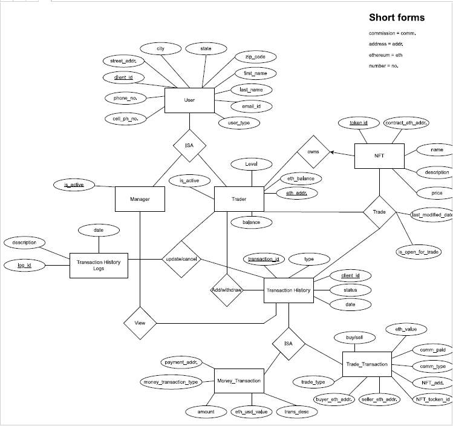

# Introduction to Database Design (CS 6360)
by [Dr. Murat Kantarcioglu](https://personal.utdallas.edu/~muratk/courses/db22f.html)
----
----


----
Project: 
----

Overview:

Motivated by the recent popularity of non-fungible tokens (NFTs), a good friend of yours would
like to set up a local shop that can buy/sell NFTs for investors in Dallas based on Ethereum
blockchain. She asked your help to develop a web based NFT trading application. In particular,
she wants you to create convenient and easy-to-use software for NFT traders who are trying to
buy and sell NFTs. To help your friend, you offer to develop a web based software system called
NTS (NFT Transaction System) that leverage the relational DBMS technology for data storage and querying.

Description:

Based on your interactions with your friend, you gathered the following pieces of information:
NTS will be used by the traders to directly buy and sell NFTs.
- Each trader has a unique client id generated by the system, a name (first and last), a
phone number, a cell-phone number, an e-mail address, and an address (including street
address, city, state, and zip code).
- Each trader is assumed to have unique Ethereum address used for trading NFTs.
- For regulatory reasons, it is important to retrieve the city and zip code information for
each trader easily.
- Each trader is assigned to one of two different levels based on his or her past transaction
volume. Once a trader makes more than $100K in trades (buy or sell) in the previous
month, the client is classified as a “Gold” customer and is charged a different
commission rate for the next month’s transaction. Otherwise, the trader is classified as
“Silver”. This classification will be updated monthly.
- Each NFT has unique token id (see ethereum uint256 type), address of the Ethereum
smart contract used for keeping track of the NFT, and the name (e.g., CryptoKitties).
- When a trader wants to execute a transaction, the trader logs into the online system and
specifies the NFT smart contract address, and the specific token the trader wants to buy
from that address. Of course, system needs to verify the client’s identity by asking the
client to enter a password, and check whether the trader has enough fiat currency (i.e.,
USD) or Ethereum in his/her account.
- The trader should be able to see the NFTs he/she owns and their current market price in
USD and Ethereum. If the trader wants to sell a NFT, the system should check whether
the trader already owns the NFT that he/she is trying to sell.
- The trader also needs to specify whether he or she wants to pay the commission for the
transaction in Ethereum or fiat currency. Based on the trader’s choices, the system places
the order. The system calculates the transaction commission based on the trader’s classification. If the transaction fee is paid in Ethereum, the system automatically adjusts
the amount of Ethereum left in the customer account. On the other hand, if the customer
chooses to pay the commission in fiat currency, the system must automatically compute
the fee based on current Ethereum prices. For example, see 3 on how to get this
information dynamically in your app. This is critical because Ethereum prices can
fluctuate a lot.
- The value of the transaction in Ethereum, the date of the transaction, the commission
paid, the commission type, the NFT address, NFT toked id, the seller Ethereum address
and the buyer Ethereum address should be stored separately for each transaction.
- From time to time, clients will transfer money/Ethreum to their account so that they can
buy more NFTs. For each payment transaction, you need to store the amount paid, the
date, type of the payment and the id related to the trader who submitted the payment, and
the payment address (e.g., bank account number of fiat currency, Ethereum address for
Ethereum payments). In your application, you may assume that all the payment
transactions will be successful.
- In some cases, traders may want to cancel certain payment and NFT transactions.
Although the system should allow such cancellations up to 15 mins after the transaction
submission, logs should be stored for such cancelations for auditing purposes.
- You should allow a trader to search his/her transaction history.
- You should also provide an interface for the manager that can give aggregate information
for daily, weekly and monthly total transactions based on the dates entered by the
manager.

Useful Links:
- [https://www.investopedia.com/non-fungible-tokens-nft-5115211](https://www.investopedia.com/non-fungible-tokens-nft-5115211)
- [https://ethereum.org/en/nft/](https://ethereum.org/en/nft/)
- [https://docs.cloud.coinbase.com/sign-in-with-coinbase/docs/api-prices](https://docs.cloud.coinbase.com/sign-in-with-coinbase/docs/api-prices)

Software Requirements
----

1. Java: 17
2. Maven: 3.8.6
3. STS: 4(Recommend code editor, but mandatory)
4. Git: latest version

Process to check in:
----

1. Create your own branch eg: develop/navaneeth.
2. Clone from it.
3. Run the db_setup.sql script in your local MySql instance.
4. Update your local user name, password and spring.datasource.url=jdbc:mysql://localhost:3306/nts_db in application.properties file (Don't push this changes to remote github)
5. Do maven clean install (Use maven build, goal shoud be "clean install").
6. Up the server.
7. Hit localhost:8080/nts/demo (To test the installation)


Entity–Relationship Design
----
<a href="./images/diagram/NFT.drawio.html" target="_top">Click here</a>

[Click here](images/diagram/NFT.drawio.html)



User Management API’s
----

| #  | URL                                                                                                                                                                                | Type | Description                                                                           |
|----|------------------------------------------------------------------------------------------------------------------------------------------------------------------------------------|------|---------------------------------------------------------------------------------------|
| 1  | [*localhost:8080/nts/user?clientId=1*](localhost:8080/nts/user?clientId=1)                                                                                                         | GET  | Returns all the information of the user based on the clientId                         |
| 2  | [*localhost:8080/nts/users*](localhost:8080/nts/users)                                                                                                                             | GET  | Returns all the list of users and their details                                       |
| 3  | [*localhost:8080/nts/addUser*](localhost:8080/nts/addUser)                                                                                                                         | POST | Adds a new user to the Database                                                       |
| 4  | [*localhost:8080/nts/updateUser*](localhost:8080/nts/updateUser)                                                                                                                   | POST | Updates a user's details to the Database                                              |
| 5  | [*localhost:8080/nts/nfts*](localhost:8080/nts/nfts)                                                                                                                               | GET  | Returns all the NFT's available                                                       |
| 6  | [*localhost:8080/nts/v1/nft?contractEthereumAddress=9a6eab44-5195-11ed-83af-004e01c09a92*](localhost:8080/nts/v1/nft?contractEthereumAddress=9a6eab44-5195-11ed-83af-004e01c09a92) | GET  | Returns all the NFT’s available with the contractEthereumAddress                      |
| 7  | [*localhost:8080/nts/v2/nft?contractEthereumAddress=9a6eab44-5195-11ed-83af-004e01c09a92*](localhost:8080/nts/v1/nft?contractEthereumAddress=9a6eab44-5195-11ed-83af-004e01c09a92) | GET  | Returns all the NFT’s available with the contractEthereumAddress                      |
| 8  | [*localhost:8080/nts/v1/nft?contractEthereumAddress=9a6eab44-5195-11ed-83af-004e01c09a92*](localhost:8080/nts/v1/nft?contractEthereumAddress=9a6eab44-5195-11ed-83af-004e01c09a92) | GET  | Returns get the NFT available with the Token ID                                       |
| 9  | [*localhost:8080/nts/create/nfts*](localhost:8080/nts/create/nfts)                                                                                                                 | GET  | Create a new NFT                                                                      | 
| 10 | [*localhost:8080/nts/get/nft*](localhost:8080/nts/get/nft)                                                                                                                         | GET  | Get an NFT                                                                            |
| 11 | [*localhost:8080/nts/get/trade/nft*](localhost:8080/nts/get/trade/nft)                                                                                                             | GET  | Fetch all the NFTS other than yours                                                   |
| 12 | [*localhost:8080/nts/addMoneyFromBofa*](localhost:8080/nts/addMoneyFromBofa)                                                                                                       | GET  | Add Money to your account's balance in USD (Money)                                    |
| 13 | [*localhost:8080/nts/debitMoneyFromWallet*](localhost:8080/nts/debitMoneyFromWallet)                                                                                               | GET  | Deposit money from the Wallet to your account                                         |
| 14 | [*localhost:8080/nts/transferWalletAmountToEth*](localhost:8080/nts/transferWalletAmountToEth)                                                                                     | GET  | Buy Ethereum with your current balance in your wallet                                 |
| 15 | [*localhost:8080/nts/transferWalletEthAmountToFait*](localhost:8080/nts/transferWalletEthAmountToFait)                                                                             | GET  | Convert Ethereum to fake currency and stores it in waller                             |
| 16 | [*localhost:8080/nts/addMoneyFromBofaToEthWallet*](localhost:8080/nts/addMoneyFromBofaToEthWallet)                                                                                 | GET  | Buy Ethereum with your bank account (i.e. Bank of America)                            |
| 17 | [*localhost:8080/nts/debitMoneyForEthmWallet*](localhost:8080/nts/debitMoneyForEthmWallet)                                                                                         | GET  | Transfer Ethereum to your bank account (i.e. Bank of America)                         |
| 18 | [*localhost:8080/nts/getAllTransactions*](localhost:8080/nts/getAllTransactions)                                                                                                   | GET  | Get all the transactions                                                              |
| 19 | [*localhost:8080/nts/getAllTransactionsByClientId?clientId=1000*](localhost:8080/nts/getAllTransactionsByClientId?clientId=1000)                                                   | GET  | Get all the transactions based on Client ID                                           |
| 20 | [*localhost:8080/nts/getAllMoneyTransactionsByTransactionId?transactionId=5*](localhost:8080/nts/getAllMoneyTransactionsByTransactionId?transactionId=5)                           | GET  | Get all Money Transactions based on Transaction ID                                    |
| 21 | [*localhost:8080/nts/performTrade*](localhost:8080/nts/performTrade)                                                                                                               | POST | Perform a Trade buying NFTs based on tokenIds. commisionType can be `fait` or `eth`   |
| 22 | [*localhost:8080/nts/validateAndCancelTheTransaction?transactionId=7*](localhost:8080/nts/validateAndCancelTheTransaction?transactionId=7)                                         | GET  | Cancel the transaction based on the transaction ID if this happened within 15 minutes |
| 23 | [*localhost:8080/nts/getAllTradeTransactionsByTransactionId?transactionId=7*](localhost:8080/nts/getAllTradeTransactionsByTransactionId?transactionId=7)                           | GET  | Get all the information are noted based on the transaction ID                         |
| 24 | [*localhost:8080/nts/getManagerStatistics?startDate=2022-11-26&endDate=2022-11-26*](localhost:8080/nts/getManagerStatistics?startDate=2022-11-26&endDate=2022-11-26)               | GET  | Retrieve all the statistics based on the Date [`Start-Date` and `End-Date`]           |

Note: When your server runs then replace **localhost:8080** with the new IP and Port, i.e. **34.66.65.153:8080**


Examples
----

```

```

```json
{
    "customerList": [
        {
            "clientId": 1,
            "firstName": "Navaneeth Kumar",
            "lastName": "Buddi",
            "emailId": "navaneethkumar.buddi@gmail.com",
            "phoneNumber": "9452449423",
            "cellPhoneNumber": "7259047234",
            "userType": "T",
            "streetAddress": "9693 Baltic LN",
            "city": "Frisco",
            "state": "Texas",
            "zipCode": "75030",
            "password": "password"
        },
        {
            "clientId": 2,
            "firstName": "Indu",
            "lastName": "C",
            "emailId": "indu.c@gmail.com",
            "phoneNumber": "9452449423",
            "cellPhoneNumber": "7259047234",
            "userType": "T",
            "streetAddress": "9693 Baltic LN",
            "city": "Frisco",
            "state": "Texas",
            "zipCode": "75030",
            "password": "password"
        },
        {
            "clientId": 3,
            "firstName": "Navaneeth Kumar",
            "lastName": "Buddi",
            "emailId": "navaneethkumar.buddi@gmail.com",
            "phoneNumber": "9452449423",
            "cellPhoneNumber": "7259047234",
            "userType": "M",
            "streetAddress": "9693 Baltic LN",
            "city": "Frisco",
            "state": "Texas",
            "zipCode": "75030",
            "password": "password"
        },
        {
            "clientId": 4,
            "firstName": "Indu",
            "lastName": "C",
            "emailId": "indu.c@gmail.com",
            "phoneNumber": "9452449423",
            "cellPhoneNumber": "7259047234",
            "userType": "M",
            "streetAddress": "9693 Baltic LN",
            "city": "Frisco",
            "state": "Texas",
            "zipCode": "75030",
            "password": "password"
        }
    ],
    "serverResponse": {
        "responseCode": 200,
        "errorMessage": "SUCCESS",
        "success": true
    }
}
```

## The Team
| Name                                                          | Contact |
|---------------------------------------------------------------|---------|
| [Navaneeth Kumar Buddi](navaneethkumar.buddi@utdallas.edu)    | [navaneethkumar.buddi@utdallas.edu](navaneethkumar.buddi@utdallas.edu) |
| [Indupriya Chegireddy](indupriya.chegireddy@utdallas.edu)     | [indupriya.chegireddy@utdallas.edu](indupriya.chegireddy@utdallas.edu) |
| [Harshavardhini Sridhar](harshavardhini.sridhar@utdallas.edu) | [harshavardhini.sridhar@utdallas.edu](harshavardhini.sridhar@utdallas.edu) | 
| [Christos Vasileiou](christos.vasileiou@utdallas.edu)         | [christos.vasileiou@utdallas.edu](christos.vasileiou@utdallas.edu) |
|  [Dibyanshi Singh](dibyanshi.singh@utdallas.edu) | [dibyanshi.singh@utdallas.edu](dibyanshi.singh@utdallas.edu) |


